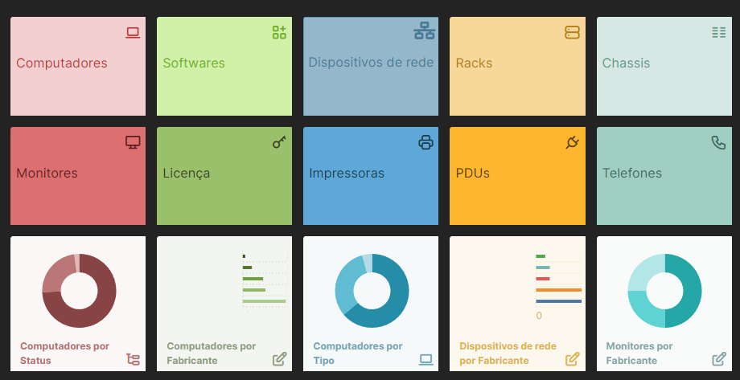

  <h1>Implementação do Software Livre GLPI para ServiceDesk e Inventário</h1>
<h3>Introdução:</h3>

  O GLPI é um incrível software de gerenciamento de serviços baseado em tecnologias de código aberto. Ele ajuda você a planejar e gerenciar mudanças de TI de maneir fácil, resolver problemas com eficiência, automatizar seus processos de negócios e obter controle sobre sua infraestrutura de TI.

<strong>Versões utilizadas:</strong>
<ul>
  <li>GLPI versão 10.0</li>
  <li>Apache versão 2.4.41</li>
  <li>PHP versão 7.4.3</li>
  <li>MySQL versão 8.0.31</li>    
  <li>Linux Ubuntu 20.04.1</li>
</ul>

<strong>Benefícios de utilização:</strong> 

  Por mais que seja um software de código aberto, o GLPI é um software extremamente completo e possui diversos benefícios em sua utilização. Dentre eles, podemos citar os seguintes:

 
<ol>
  <li>
    Servicedesk completo: O módulo de servicedesk do GLPI possui todos os recursos necessários para atender cenários de demanda e atribuição. Dentro de um chamado, podemos controlar diversas características, como entidade, data, data limite, SLA, localização, categoria, requerente, observadores, atribuídos, itens relacionados, itens ITIL (chamados mudanças e problemas) relacionados, e vários outros.
</li> 
<li>
  Inventário abrangente: Já no que remete a inventário, o GLPI está longe de ser simples. Nesse software, podemos registrar Computadores, Monitores, Dispositivos de Rede, Racks, Impressoras, Insumos, Dispositivos passivos e qualquer coisa que seja controlável pelo time de T.I. Além disso, os itens podem ser linkados entre si, indicando dependência, conjuntos e níveis de relação.</li>
<li>
  Interface simplificada: A interface do software é extremamente simples, tanto para quem utiliza como administrador, quanto para quem utiliza apenas para registro dos chamados.
</li> 
<li>
  Integrações: O GLPI pode ser integrado com outras diversas soluções, contando com notificações via e-mail, inventário automático via plugins como o OCS Inventory NG e FusionInventory, além de ser integrável com o Active Directory, automatizando a criação de logins.
</li>
</ol> 

<strong>Estudo de Caso:</strong> 

Na empresa onde trabalho atualmente, havia um simples sistema de servicedesk, o Pipefy. Contudo, para a complexidade de chamados atendidos e alta necessidade de inventariar nossos ativos de forma organizada, o mesmo já não estava atendendo nossa demanda. Então, o software GLPI foi colocado em pauta, organizamos um servidor linux, instalamos as dependências necessárias, bancos de dados e inicamos o uso da aplicação. Logo no princípio, o software se mostrou extremamente competente, e aos poucos, ocorreu a parametrização e o ajuste das métricas necessárias.

<strong>Método de implantação:</strong> 
<ol>
<li>
  Migração: Em primeiro lugar, migramos alguns dos chamados recentes que estavam no pipefy, para termos um histórico de no mínimo um mês na nova plataforma.
</li> 
<li>Introdução aos usuários: Por já estarem acostumados com outra ferramenta de chamados, foi apenas mostrar como o GLPI funcionava e era superior ao usado anteriormente, pois mudanças sempre tendem a assustar usuários. Começamos de maneira gradativa, mostrando aos usuários como utilizar, a importância da utilização e como o uso do mesmo afeta todo o fluxo do setor.
</li> 
<li>Parametrização dos serviços: Quando iniciamos a habituação do público com o sistema, o próximo passo foi inserir as categorias,
localizações, e coisas que seriam relavantes para mensurarmos serviços em nossa empresa.
</li>
<li>Integração com o Active Directory: Para facilitar o acesso dos colaboradores, integramos com o AD que já era utilizado em nossa empresa, fazendo que todos que já possuíam um usuário cadastrado pudessem abrir chamados.
</li>
<li>Parametrização dos ativos: Quando o sistema de servicedesk já estava usual, mapeamos os computadores, impressoras, softwares, celulares e todos ativos com auxílio do Fusion Inventory. Para maior controle, também montamos os Racks Virtualmente, efetuamos as conexões das portas de rede e efetuamos o registro de tudo isso na solução.
</li>
</ol>

<strong>Imagens:</strong> 

<em>Dashboard de ativos</em>

<em>Estados dos chamados</em>

<strong>Considerações Finais:</strong> 

O conteúdo apresentado foi apenas um nuance do verdadeiro potencial do GLPI, onde o objetivo era mostrar como o software simplificou a vida do setor de T.I e se mostrou uma verdadeira potência no mundo dos open-source. Caso haja planejamento e conhecimento acerca do mesmo, ele pode ser utilizado para fazer basicamente qualquer coisa.
